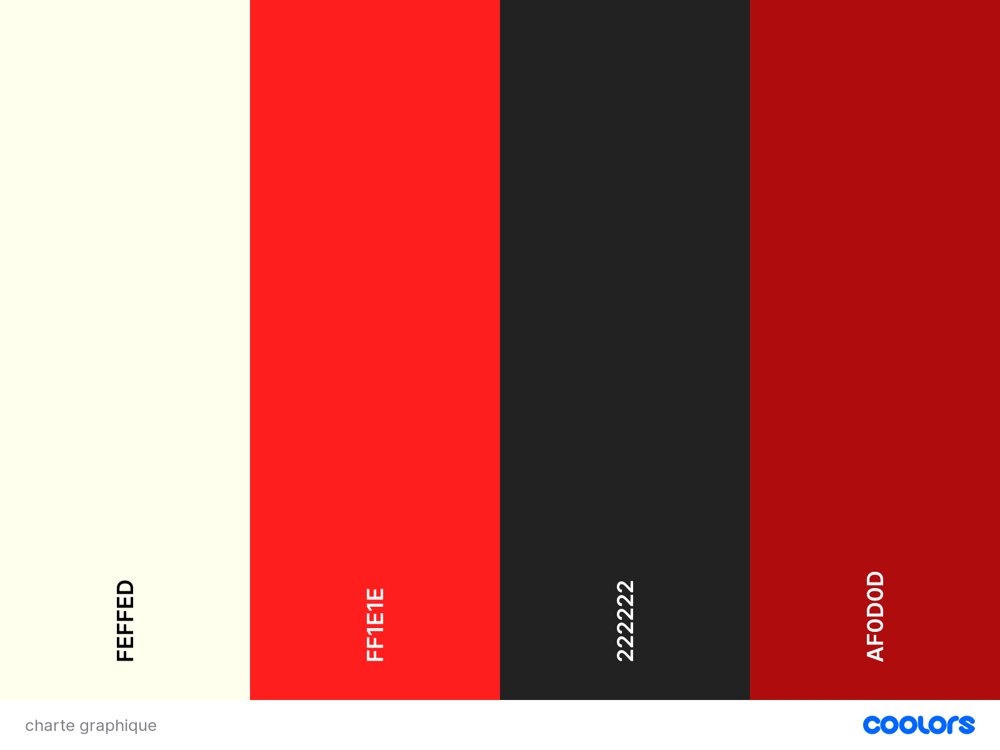

# Projet CINEMA

## Développement d’une page publicitaire pour une chaîne Streaming

### Pour AFFICHER le projet :
[afficher le site](https://elbzhiba.github.io/cinema/) 
### Charte de police :
Dans ce site j'ai utilisé le style de police suivant :
('https://fonts.googleapis.com/css2?family=Montserrat:wght@100;300;400;600;700&display=swap');
### Chartes graphiques : 

 